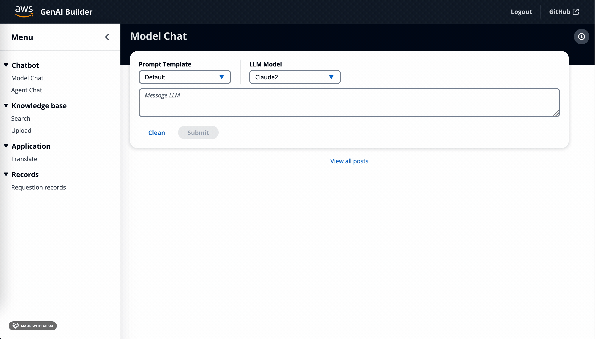
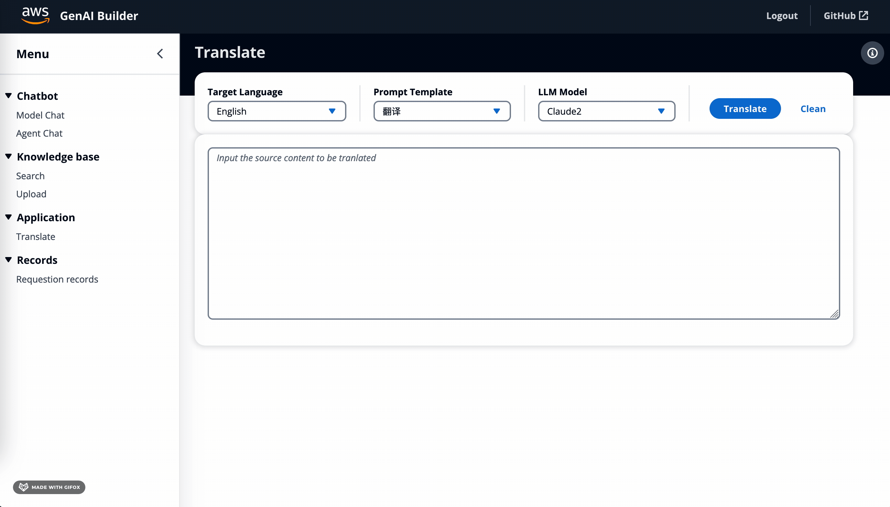

# GenAI Builder Solution

GenAI Builder is a generative AI solution based on Amazon Bedrock services.

Introducing Amazon Bedrock:
Amazon Bedrock is a fully managed service that offers a choice of high-performing foundation models (FMs) from leading AI companies like AI21 Labs, Anthropic, Cohere, Meta, Stability AI, and Amazon via a single API, along with a broad set of capabilities you need to build generative AI applications with security, privacy, and responsible AI. Using Amazon Bedrock, you can easily experiment with and evaluate top FMs for your use case, privately customize them with your data using techniques such as fine-tuning and Retrieval Augmented Generation (RAG), and build agents that execute tasks using your enterprise systems and data sources. Since Amazon Bedrock is serverless, you don't have to manage any infrastructure, and you can securely integrate and deploy generative AI capabilities into your applications using the AWS services you are already familiar with.


Goal:
1. Help users use Bedrock services more conveniently and understand the capabilities of generative AI;
2. Help users quickly leverage Bedrock to develop, deploy, and industrialize GenAI application projects;


Features:
1. One-click deployment, simple and convenient;
2. Use ServerLess services for development and scheduling, low cost;

# Architecture


# Features Introduction





# Deploy Manual

## Video : Full deploy progress 
Here is a video to demostrate how to deploy this solution.

- Chinese Language: 

  - https://www.bilibili.com/video/BV1eg4y1k7dG/?vd_source=6df02a0ae1f07534259dc93752e87f7c


## 1. Prepare

1. AWS CLI Upgrade
    
    [https://docs.aws.amazon.com/cli/latest/userguide/getting-started-install.html](https://docs.aws.amazon.com/cli/latest/userguide/getting-started-install.html)

    If you are using Linux x86, the following script can used to upgrade:
    to makke sure your AWS cli version >= 2.15.4
    ```jsx
    sudo yum update -y

    curl "https://awscli.amazonaws.com/awscli-exe-linux-x86_64.zip" -o "awscliv2.zip"
    unzip awscliv2.zip
    sudo ./aws/install --bin-dir /usr/local/bin --install-dir /usr/local/aws-cli --update
    ```
2. AWS CDK Upgrade
    
    [https://docs.aws.amazon.com/sdk-for-javascript/v2/developer-guide/setting-up-node-on-ec2-instance.html](https://docs.aws.amazon.com/sdk-for-javascript/v2/developer-guide/setting-up-node-on-ec2-instance.html)

    to makke sure your CDK version >= 2.116.1 and npm version >= 10.2.5
    
    ```jsx
    curl -o- https://raw.githubusercontent.com/nvm-sh/nvm/v0.39.5/install.sh | bash
    . ~/.nvm/nvm.sh
    nvm install v18.19.0

    sudo yum install nodejs npm -y
    curl -qL https://www.npmjs.com/install.sh | sh
    sudo npm install -g typescript -y
    sudo npm install -g aws-cdk -y
    cdk --version
    npm --version
    ```
3.  AWSCurl
    https://github.com/okigan/awscurl

    ```jsx
    sudo yum install pip -y
    pip install awscurl
    awscurl
    ```

4. Set Local Access Key and Secret Key, use a user access key which has access to deploy.
    
    Prepare an access key first, which have access to create releated resources.

    https://docs.aws.amazon.com/IAM/latest/UserGuide/id_credentials_access-keys.html

    Then set up the aws cli:
    https://docs.aws.amazon.com/cli/latest/userguide/getting-started-quickstart.html#getting-started-quickstart-new-command

    ```jsx
    aws configure
    ```
    


## 2. Deploy

### 2.1 Get the latest source code from Github

```jsx
sudo yum install git -y
git clone https://github.com/cloudswb/aws-genai-bedrock-builder.git
```

### 2.2 PreConfig deployment

We can customize the project name prefix, this prefix will add to the CDK stack and Lambda function name.

```jsx
cd aws-genai-bedrock-builder/
```

```jsx
vim bin/config.ts
```

Now you can modify this config file according the following comments:

```jsx
export const Config = {
    DomainName: 'piyao.com', // The domain name(used as a website S3 bucket with SiteSubDomain
    SiteSubDomain: 'genai-dev', // combine with DomainName as a S3 bucket name
    Region: "us-east-1", // The region will be deploy, suggest same with aws cli credentional setting.
    Auth: 'iam' //Auth type, DO NOT Change, we only support this IAM auth type currently.
}
```

### 2.3 Run deployment

Run the following shell script to deploy Backend service:

```jsx
sudo npm install
chmod +x ./bin/deploy.sh
./bin/deploy.sh
```

After deploy finished, there will have a CloudFront distribution info print out.


## 3. Run website

### 3.1 Prepare login user in Cognito user pool

You can get the Cognito info from CloudFormation stack “[XXX]CognitoUserPoolStack”


### 3.2 Run Website deployment

Get the output the CloudFront Address: like the url : [d21wi5ogab28wm.cloudfront.net](http://d21wi5ogab28wm.cloudfront.net/) according to outputs.


Login use the user created in Chapter 4.1:


## 4. Destroy resources
```jsx
chmod +x ./bin/destroy.sh
./bin/destroy.sh 
```

## 5. Advance Operation

<!-- ### 5.1 Change the project name to deploy multiple  -->

