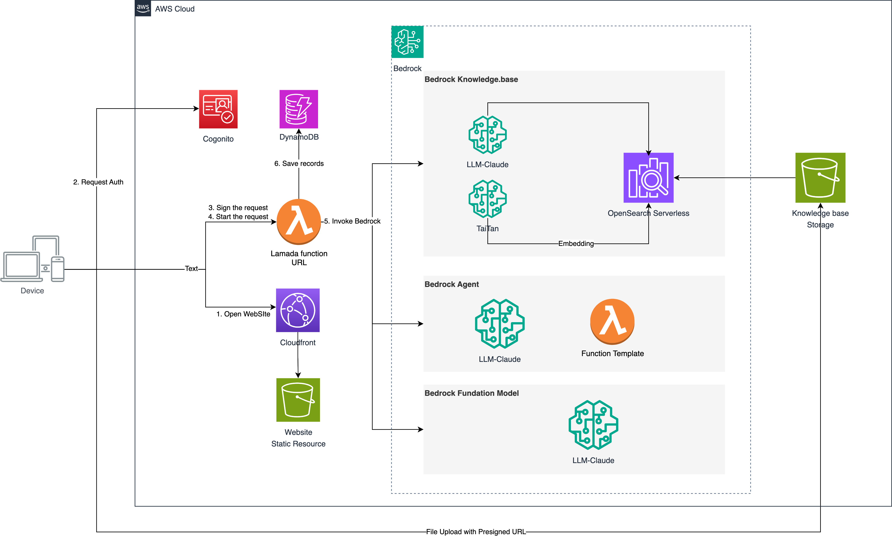
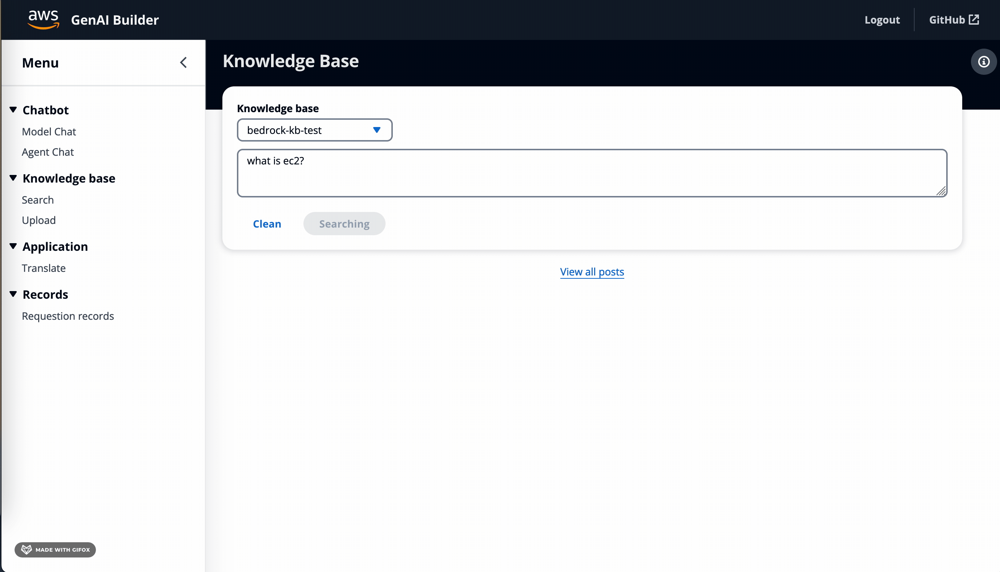

# GenAI Builder Solution

GenAI Builder is a generative AI solution based on Amazon Bedrock services.


Introducing Amazon Bedrock:
Amazon Bedrock is a fully managed service that offers a choice of high-performing foundation models (FMs) from leading AI companies like AI21 Labs, Anthropic, Cohere, Meta, Stability AI, and Amazon via a single API, along with a broad set of capabilities you need to build generative AI applications with security, privacy, and responsible AI. Using Amazon Bedrock, you can easily experiment with and evaluate top FMs for your use case, privately customize them with your data using techniques such as fine-tuning and Retrieval Augmented Generation (RAG), and build agents that execute tasks using your enterprise systems and data sources. Since Amazon Bedrock is serverless, you don't have to manage any infrastructure, and you can securely integrate and deploy generative AI capabilities into your applications using the AWS services you are already familiar with.


Goal:
1. Help users use Bedrock services more conveniently and understand the capabilities of generative AI;
2. Help users quickly leverage Bedrock to develop, deploy, and industrialize GenAI application projects;


Features:
1. One-click deployment, simple and convenient;
2. Use ServerLess services for development and scheduling, low cost;


[This solution is only for PoC, not Amazon web service official solution]

# Architecture




# Deploy Manual

## Video : Full deploy progress 
Here is a video to demostrate how to deploy this solution.

- Chinese Language: 

  - https://www.bilibili.com/video/BV1eg4y1k7dG/?vd_source=6df02a0ae1f07534259dc93752e87f7c


## 1. Prepare

1. EC2 with Amazon Linux 2023
    - AMI:  Amazon Linux 2023 x86
    - Instance Type: t3.xlarge
    - EBS: >=10GB
    - Network: Public access with SSH

2. AWS CLI Upgrade
    
    [https://docs.aws.amazon.com/cli/latest/userguide/getting-started-install.html](https://docs.aws.amazon.com/cli/latest/userguide/getting-started-install.html)

    If you are using Linux x86, the following script can used to upgrade:
    to makke sure your AWS cli version >= 2.15.4
    ```jsx
    sudo yum update -y

    curl "https://awscli.amazonaws.com/awscli-exe-linux-x86_64.zip" -o "awscliv2.zip"
    unzip awscliv2.zip
    sudo ./aws/install --bin-dir /usr/local/bin --install-dir /usr/local/aws-cli --update
    ```
3. AWS CDK Upgrade
    
    [https://docs.aws.amazon.com/sdk-for-javascript/v2/developer-guide/setting-up-node-on-ec2-instance.html](https://docs.aws.amazon.com/sdk-for-javascript/v2/developer-guide/setting-up-node-on-ec2-instance.html)

    to makke sure your CDK version >= 2.116.1 and npm version >= 10.2.5
    
    ```jsx
    curl -o- https://raw.githubusercontent.com/nvm-sh/nvm/v0.39.5/install.sh | bash
    . ~/.nvm/nvm.sh
    nvm install v18.19.0

    sudo yum install nodejs npm -y
    curl -qL https://www.npmjs.com/install.sh | sh
    sudo npm install -g typescript -y
    sudo npm install -g aws-cdk -y
    cdk --version
    npm --version
    ```
4.  AWSCurl
    https://github.com/okigan/awscurl

    ```jsx
    sudo yum install pip -y
    pip install awscurl
    awscurl
    ```

5. Set Local Access Key and Secret Key, use a user access key which has access to deploy.
    
    Prepare an access key first, which have access to create releated resources.

    https://docs.aws.amazon.com/IAM/latest/UserGuide/id_credentials_access-keys.html

    Then set up the aws cli:
    https://docs.aws.amazon.com/cli/latest/userguide/getting-started-quickstart.html#getting-started-quickstart-new-command

    ```jsx
    aws configure
    ```
    


## 2. Deploy

### 2.1 Get the latest source code from Github

```jsx
sudo yum install git -y
git clone https://github.com/cloudswb/aws-genai-bedrock-builder.git
```

### 2.2 PreConfig deployment

We can customize the project name prefix, this prefix will add to the CDK stack and Lambda function name.

```jsx
cd aws-genai-bedrock-builder/
```

```jsx
vim bin/config.ts
```

Now you can modify this config file according the following comments:

```jsx
export const Config = {
    DomainName: 'xxx.com', // The domain name (will combine with <SiteSubDomain> to create a S3 bucket name like: <SiteSubDomain>.<DomainName>)
    SiteSubDomain: 'genai-dev', // will combine with <DomainName> to create a S3 bucket name like: <SiteSubDomain>.<DomainName>
    Region: "us-east-1", // Target region will be deploy, the region should have bedrock\opensearch serverless available.
    Auth: 'iam', //Auth type, DO NOT Change, we only support this IAM auth type currently.
    KBEmbeddingModelName: "amazon.titan-embed-text-v1", //Knowledge base Embedding Model ID
    KBLLMName: "anthropic.claude-v2", // Knowledge base LLM ID
    AgentLLMName: "anthropic.claude-v2", // Bedrock agent LLM ID
}
```

### 2.3 Run deployment

Run the following shell script to deploy all services:

```jsx
sudo npm install
chmod +x ./bin/deploy.sh
./bin/deploy.sh
```

After deploy finished, there will have a CloudFront distribution info print out.

## 3. Run website

You can open the CloudFront distribution link directly, but to use the system, you should create a user in Cognito user pool first.

### 3.1 Prepare login user in Cognito user pool

You can get the Cognito info from CloudFormation service, the stack name should like “[XXX]CognitoUserPoolStack”.


Open the user pool and create a new user with customized username and password.


### 3.2 Run Website deployment

Get the output of the CloudFront distribution address from you shell client: like the url : [d21wi5ogab28wm.cloudfront.net](http://d21wi5ogab28wm.cloudfront.net/).

You also can get this CloudFront distribution address from output information of CloudFormation stack (stack name like [xxx]).


## 4. Destroy resources
```jsx
chmod +x ./bin/destroy.sh
./bin/destroy.sh 
```

## 5. Upgrade / ReDeploy

Sometimes to fix a issue or use to new feature, you may need to upgrade the solution.

1. Delete lambda function and Frontend website.

    Generally you only need to delete the following Stack from CloudFormation Service:

    - GenAIBuilderCloudFrontWebsiteStack
    - GenAIBuilderLambdaFunctionStack

    If you want delete all resources, you may refer to section 4 to destroy all(include knowledgebase and agent).
    ```jsx
    chmod +x ./bin/destroy.sh
    ./bin/destroy.sh 
    ```

2. Backup the config file

```jsx
// backup the pre configed file as the following commands may override this file
cp bin/config.ts bin/config.ts.backup 
```

3. Force to get latest sourcecode
   ```jsx
    git checkout .
    git pull
    ```

4. Re-Deploy the solution

    ```jsx
    sudo npm install
    chmod +x ./bin/deploy.sh
    ./bin/deploy.sh
    ```


## 6. Enable Bedrock Agent Conversation Feature

Open the Advanced prompts: IN  Amazon Bedrock > Agents > genai-builder-agent > Working draft.

### 6.1 Active "Orchestration" in Advanced prompts:

- Enable "Override orchestration template defaults" toggle button
- Enable "Activate orchestration template" toggle button
- Input the following prompt into prompt template(You also can adjust this template as you needed):

```jsx


Human:
You are a research assistant AI that has been equipped with one or more functions to help you answer a <question>. Your goal is to answer the user's question to the best of your ability.
You were created with these instructions to consider as well:
<auxiliary_instructions>$instruction$</auxiliary_instructions>

$prompt_session_attributes$

Always return your final answer within <answer></answer> tags.

$conversation_history$

The user input is <question>$question$</question>


Assistant: <scratchpad> I understand I cannot use functions that have not been provided to me to answer this question.

$agent_scratchpad$
```

### 6.2 
Amazon Bedrock > Agents > genai-builder-agent > Aliases

Create a new aliaes, and Get the new created Aliaes ID.

### 6.3 Active this new Aliaes ID in front-end

Open 'backend.json' file in src/frontend folder.

Replace the value of attribute "agentAlias" to new Aliaes ID created in step 6.2.

Now, you can go to the cloudformation and delete the website related stack (which named like xxxCloudFrontWebsiteStack)
Then re-deploy the project like Step #5.4.

# Features Introduction




